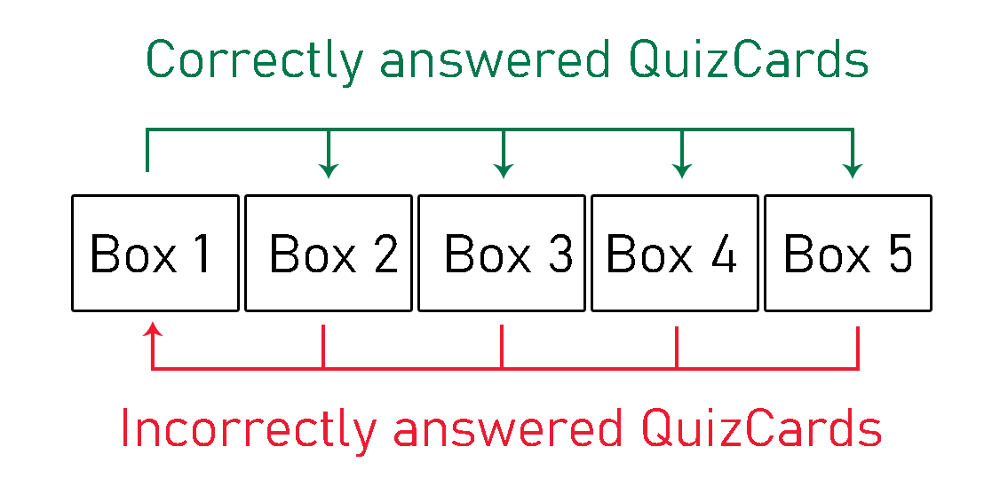
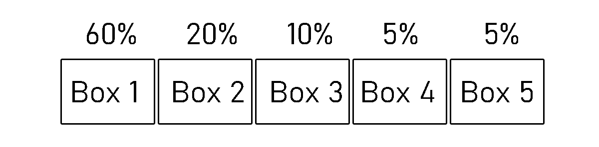

# Architecture

## Structure

_quiztrainer.ui_ holds an user interface implemented in Java FX
_quiztrainer.domain_ holds the main components QuizCard and Box
_quiztrainer.logic_ has the logic side including QuizCard interval and Leitner implementation
_quiztrainer.dao_ takes care of the data being saved

_As of now, dao classes have not been initialized._

## User interface

User interface has five different scenes:
- Login
- Signup
- Add a card
- Rehearse
- Statistics

_As of now, login and statistics scenes have not been initialized._

Each of the view has their own Scene-object. Structurality of user interface can be viewed from [quiztrainer.ui.UserInterface](https://github.com/tommise/ot-harjoitustyo/blob/master/QuizTrainer/src/main/java/quiztrainer/ui/UserInterface.java).

## Software logic

The main functionalities can be found from packages _quiztrainer.domain_ and _quiztrainer.logic_.

### quiztrainer.domain

**Class QuizCard:**
- A QuizCard has a question, correct answer and a set of false answers.

**Class Box:**
- A box holds x number of cards between 0...n. Each box has a number. This QuizCard application uses five boxes to implement a slightly modified version of [Leitner system](https://en.wikipedia.org/wiki/Leitner_system).

### quiztrainer.logic

**Class Leitner:**
- Contains five Box objects
- Adds a new card to Box 1
- Moves a card from box to another based on the answer, using so called Leitner system. If the answer is wrong, card will be moven to Box 1. If the answer is right, card will be moven up.

**Class Interval:**
- Picks a random box with probabilities (60%, 20%, 10%, 5%, 5%) where higher priority is given
to Box number 1 (60%). 
- Picks a random QuizCard from the drawn box

**Class Trainer:**
- Adds a card to the leitner system
- Returns a QuizCard to rehearse if there are QuizCards available
- Checks whether an answer is right or wrong, updates Leitner and sends the information back to rehearse scene.

_As of now, class Trainer handles much of the work that quiztrainerService DAO object will handle_

## Data handling

Package _quiztrainer.dao_ will hold classes to save QuizCard, User and Leitner information into a database.
