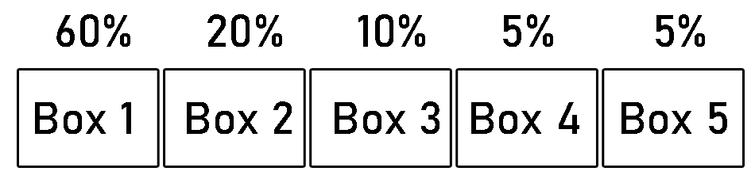

# Architecture

## Structure

_quiztrainer.ui_ holds an user interface implemented in Java FX
_quiztrainer.domain_ holds the main components QuizCard and Box
_quiztrainer.logic_ has the logic side including QuizCard interval and Leitner implementation
_quiztrainer.dao_ takes care of the data being saved

_As of now, dao classes have not been initialized._

## User interface

User interface has five different scenes:
- Login
- Signup
- Add a card
- Rehearse
- Statistics

_As of now, statistics scene has not been initialized._

Each of the view has their own Scene-object. Structurality of user interface can be viewed from [quiztrainer.ui.UserInterface](https://github.com/tommise/ot-harjoitustyo/blob/master/QuizTrainer/src/main/java/quiztrainer/ui/UserInterface.java).

## Software logic

The main functionalities can be found from packages _quiztrainer.domain_ and _quiztrainer.logic_.

### quiztrainer.domain

**Class QuizCard:**
- A QuizCard has a question, correct answer and a set of false answers.

**Class Box:**
- A box holds x number of cards between 0...n. Each box has a number. This QuizCard application uses five boxes to implement a slightly modified version of [Leitner system](https://en.wikipedia.org/wiki/Leitner_system).

**Class Deck:**
- A Deck has five Box objects.
- New card will be added to Box 1.
- Next question will be drawn from the deck using Leitner and CardInterval classes.

**Class User:**
- User has username and name information.

The implementation of these classes is straightforward:
- User can make as many QuizCards as he wishes, one QuizCard will be pointed to one User
- A quizcard will belong to one unique Box, a box can have as many cards as possible from 0...n.
- A deck has five different and numerally named boxes, one box will belong to only one deck
- User can make as many Decks as possible. In the initial stage, all cards go to the "Defaul deck". One deck will belong to one user.

### quiztrainer.logic

**Class Leitner:**
- Moves a card from box to another based on the answer, using so called Leitner system. If the answer is wrong, card will be moven to Box 1. If the answer is right, card will be moven up.

**Class CardInterval:**
- Picks a random box with probabilities (60%, 20%, 10%, 5%, 5%) where higher priority is given
to Box number 1 (60%). 
- Picks a random QuizCard from the drawn box.

**Class Trainer:**
- Adds a card to the leitner system
- Returns a QuizCard to rehearse if there are QuizCards available
- Checks whether an answer is right or wrong, updates Leitner and sends the information back to rehearse scene.

_As of now, class Trainer handles much of the work that quiztrainerService DAO object will handle_

## Data handling

Package _quiztrainer.dao_ will hold classes to save User, QuizCard, Box and Deck information into the database. The information will be saved to quiztrainer.db using SQL.

**Class Database:**
- Initializes a new database and handles connection.

**Classes UserDAO and FileUserDAO:**
- Saves new user data and searches user information from database.

**Class QuizTrainerService:**
- As of now, QuizTrainerService handles User information: adding a new user, logging user in and logging user out.

## Sequence diagrams

### User signup

When the user fills the username and name forms, class GUIHelper will check whether the inputs are valid. If the input is valid and the username is available, QuizTrainerService will create a new User with given username and name as parameters. A message will be shown to the user for successfully creating an account. The scene will not change as the user has the possibility to go back to starting menu.

### User login

As user has filled username field and clicked the Login button, QuizTrainerService will check from UserDao whether the user exists. If QuizTrainerService sends back the information that username was found, the scene will be changed to the mainScene where user has the choices to Add a card, Rehearse and Logout.

