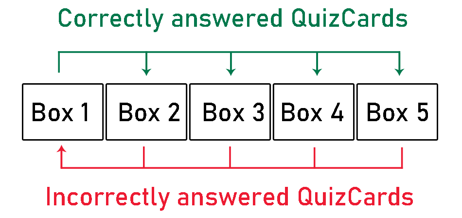
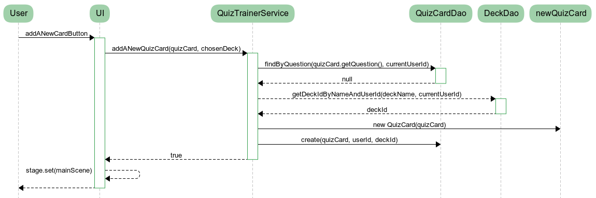
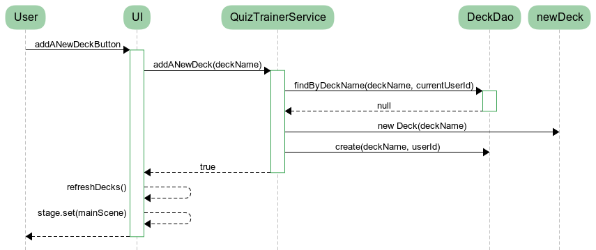

# Architecture

## Structure

_quiztrainer.ui_ holds an user interface implemented with JavaFX.
_quiztrainer.domain_ holds the main logic with the main Class [QuizTrainerService](https://github.com/tommise/ot-harjoitustyo/blob/master/QuizTrainer/src/main/java/quiztrainer/domain/QuizTrainerService.java), accompanied with all the classes related to the program functionality: QuizCard, Box, Deck and User.
_quiztrainer.utils_ has the main utilities related to program, Leitner and CardInterval.
_quiztrainer.dao_ takes care of the data being stored to the database.

## User interface

The user interface has ten different scenes:
- _Starting scene_ with login and signup options
- _Login scene_
- _Signup scene_
- _Main scene_ acts as a basis or 'starting menu' for the whole program
- _Add a new QuizCard scene_
- _Add a Deck scene_
- _My cards scene_ where user can list and remove cards
- _Initial rehearse scene_ where you choose a Deck to rehearse from
- _Main rehearse scene_
- _Statistics scene_

Each of these views has their own Scene-object. Structurality of user interface can be found from [quiztrainer.ui.UserInterface](https://github.com/tommise/ot-harjoitustyo/blob/master/QuizTrainer/src/main/java/quiztrainer/ui/UserInterface.java).

## Software logic

The main functionalities can be found from packages _quiztrainer.domain_ and _quiztrainer.utils_ where _domain package_ acts as the main structure and _utils package_ handles the logic behind moving and picking QuizCards from the Decks and Boxes explained below.

### quiztrainer.domain

**Class QuizTrainerService**
- As stated, the main driver for the software logic can be found from the [QuizTrainerService](https://github.com/tommise/ot-harjoitustyo/blob/master/QuizTrainer/src/main/java/quiztrainer/domain/QuizTrainerService.java). QuizTrainerService handles the logic between UI and Data Access Objects. QuizTrainerService takes care of adding a new user, logging users in, logging users out, adding a new QuizCard, adding a new Deck, fetching a new QuizCard for the user in rehearse mode, handling right and wrong answers based on answer of the user, giving user QuizCard statistics and updates/refreshes Deck and QuizCard for the user interface.

**Class QuizCard:**
- A QuizCard has a question, correct answer and a set of false answers. For statistics purposes it also holds the information how many times a card has been answered correctly and in total. To keep information about particular Deck the QuizCard belongs to, it holds a variable for deck id.

**Class Box:**
- A box object holds x number of QuizCards between 0...n. Each box has a number. This QuizCard application uses five boxes to implement a slightly modified version of [Leitner system](https://en.wikipedia.org/wiki/Leitner_system).

**Class Deck:**
- A Deck has five Box objects.
- New card will be added to Box 1.

**Class User:**
- User has username and name information.

The implementation of these classes is straightforward:
- User can make as many QuizCards as he wishes, one QuizCard will be pointed to one User.
- A QuizCard will belong to one unique Box, a Box can have as many cards as possible from 0...n.
- A Deck has five different and numerally named Boxes, one Box will belong to only one Deck.
- User can make as many Decks as possible. In the initial stage, all cards go to the "Default deck". One Deck will belong to one user.

### quiztrainer.utils

**Class Leitner:**
- Moves a card from box to another based on the answer, using so called Leitner system. If the answer is wrong, card will be moven to Box 1. If the answer is right, card will be moven up.

**Class CardInterval:**
- Picks a random box with probabilities (60%, 20%, 10%, 5%, 5%) where higher priority is given
to Box number 1 (60%). 
- Picks a random QuizCard from the drawn box.

## Data handling

Package _quiztrainer.dao_ holds the appropriate classes to store information into the database. The information will be saved into quiztrainer.db using SQL.

**Class Database:**
- Initializes the database and handles connection.

### Data access objects

All the Data Access Object classes act more or less the same way with different information related to them. They update or give a particular information from database using SQL statements. Most of the classes are searching the database with specific user id. That is because a Deck object may have identical name between many users, same is true with QuizCard objects.

**Classes UserDao and DbUserDao**
- Creates User object
- Finds user by username
- Gets user id with username information.

**Classes DeckDao and DbDeckDao**
- Creates a Deck for specific user id
- Finds a Deck object by deck name and user id
- Finds and returns the id of a Deck by deck name and user id
- Returns all the decks related to particular user id

**Classes QuizCardDao and DbQuizCardDAO**
- Creates a new QuizCard for specific user id and deck id
- Deletes a QuizCard
- Returns QuizCard id with question and user id information
- Returns QuizCard with question and user id
- Sets a new Box for the QuizCard
- Sets a new amount how many times the QuizCard has been rehearsed
- Sets a new amount how many times the QuizCard has been answered right
- Returns all QuizCards related to specific user id
- Returns all the QuizCards related to specific deck and user

## Sequence diagrams of main functionalities

### User signup

When the user fills the username and name forms, class GUIHelper will check whether the inputs are valid. If the input is valid and the username is available, QuizTrainerService will create a new User with given username and name as parameters. The scene will be changed to the login and a message will be shown to the user for successfully creating an account..

### User login

As user has filled username field and clicked the _Login_ button, QuizTrainerService will check from UserDao whether the user exists. If QuizTrainerService sends back the information that username was found, the scene will be changed to the main scene.

### Adding a new QuizCard

As the user has typed and chosen the appropriate QuizCard information (question, answers and deck) and pressed the _Add a new question_ button, QuizTrainerService proceeds to check from QuizCardDao whether the card has been already made. If no further complications arise, QuizTrainerService will create a new QuizCard with given values, user will be given a notification that adding was successful and the scene will change to main scene.

### Adding a new Deck

As the user has typed in the Deck name, QuizTrainerService acts similar to the QuizCard above and checks whether a Deck with particular user id has been already made with the help of DeckDao. If not, a new Deck will be made, user gets notification for that, UI calls the function refreshDecks() and scene will change to main scene.

