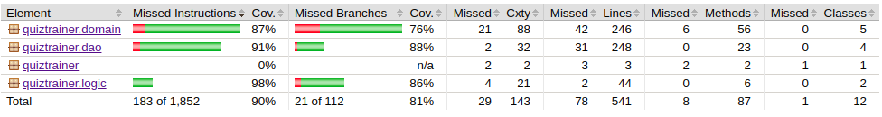
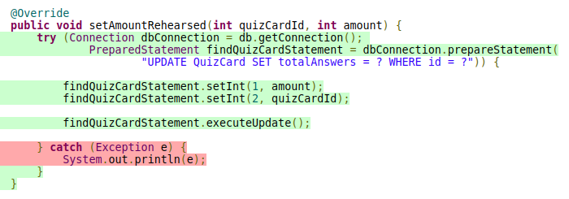

# Test Documentation

Software has been tested with unit- and integration tests with JUnit unit testing framework. 

## Unit- and integration tests

The main functionality which is located in the _quiztrainer.domain_ package is tested with the class [QuizTrainerServiceTest](https://github.com/tommise/ot-harjoitustyo/blob/master/QuizTrainer/src/test/java/quiztrainer/domain/QuizTrainerServiceTest.java). The integration tests create a temporary database file _quiztrainerTest.db_ and use the QuizTrainerService as the app would use it with the normal _quiztrainer.db_ database. After the test are done, or namely in teardown phase, the database test database file is removed.

### DAO

Class [QuizTrainerService](https://github.com/tommise/ot-harjoitustyo/blob/master/QuizTrainer/src/main/java/quiztrainer/domain/QuizTrainerService.java) acts as a intermediary between the SQLite database and UI. With this in mind, [QuizTrainerServiceTest](https://github.com/tommise/ot-harjoitustyo/blob/master/QuizTrainer/src/test/java/quiztrainer/domain/QuizTrainerServiceTest.java) holds all the propriety test to functionally test the classes in _quiztrainer.dao_ as it's method call the dao class in question.

### Utils

The main utils of the app, namely Leitner system and Card interval classes, have been tested accordingly in [LeitnerTest](https://github.com/tommise/ot-harjoitustyo/blob/master/QuizTrainer/src/test/java/quiztrainer/domain/QuizTrainerServiceTest.java) and [CardIntervalTest](https://github.com/tommise/ot-harjoitustyo/blob/master/QuizTrainer/src/test/java/quiztrainer/domain/QuizTrainerServiceTest.java).

## Test coverage

When we run the command "mvn test jacoco:report" and create the test coverage raport shown here:

We can see that with _quiztrainer.domain_ we have a total test coverage of 87% in missed instructions, _quiztrainer.dao_ 87% and _quiztrainer.utils_ 98% respectively. That makes it 215 instructions missed from the total of 1861 bringing the total coverage of missed instructions to 90%.

As what comes to missed branches, the coverage of _quiztrainer.domain_ is 76%, _quiztrainer.dao_ 57% and _quiztrainer.utils_ 86%. Bringing the total coverage of missed branches to 73%.

As we further inspect what causes the branch coverage to be relatively low in Dao classes, we can see from the Jacoco report that the branches that are being missed are by far the catch clauses of try-catch statements with the Dao classes.

Note that UI has been excluded from the raport, as project instructions instruct.

### Installation and configuration

The software has been tested following [User Instructions](https://github.com/tommise/ot-harjoitustyo/blob/master/documentation/user_instructions.md) in a Linux environment. For a broader test coverage multiple users have been added and tested.

### Functionalities

The functionalities has been tested as in [Requirements specification](https://github.com/tommise/ot-harjoitustyo/blob/master/documentation/requirements_specifications.md) document states them. Package _quiztrainer.ui_ holds a class named GUIHelper which tested successfully the invalid inputs like empty fields during testing.

Final release was tested on the Cubbli version of Linux through student laptop.

## Further notes and possible bugs
- The main challenge regarding software stability was to prevent multiple identical QuizCard and Deck names from getting mixed between users. As all new users are initialized with a deck named "Default deck", this was extremely important. Although User, Deck and QuizCard id:s are used extensively, there may be still scenarios where a bug may occur.
- Database connections and PreparedStatements are wrapped as parameters for try (try-catch clause) to prevent connection leakage and the whole program uses one single connection from separated Database class. However this does not fully prevent the possibility that a connection would be left open.
- Max length for user inputs are all 25 characters (except a QuizCard question which may be long, 40 characters). User inputs are checked for length and validity in GUIHelper class. However the impact for user interface using max length inputs was not tested extensively in all user interface scenes. 
- JavaFX was configurated during the week 4. At first, the JavaFX did not function because of Java version related issues. With the help of senior advisors, Maven was able to integrate JavaFX.
- Regarding previous point, there are ten scenes in the user interface. This leaves room for user interface mistakes as it is not tested.
