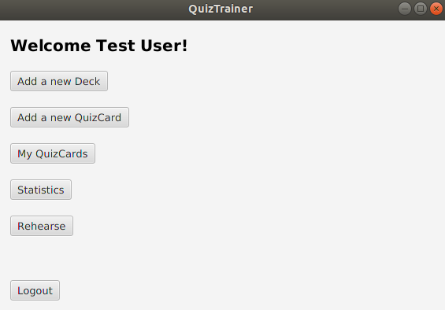
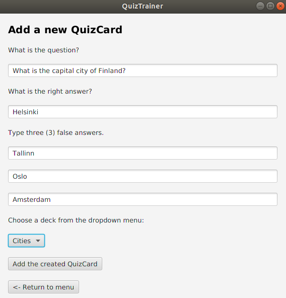
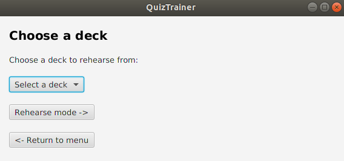

# User instructions

Download the latest jar file from [Releases](https://github.com/tommise/ot-harjoitustyo/releases/).

### Running the app
Run the app by writing following statement to the command line:
```
java -jar quiztrainer.jar
```

## Starting screen
Once the app has been launched, you will be forwarded to the starting screen. If you already have an account, you can move to login by pressing _Login_ button. Otherwise, consider signing up by pressing _Signup_ button.


### Signup
Creating a new account is straightforward, fill in your username and name on their corresponding fields and press _Signup_ button. If the username is valid, being it is not already taken or in invalid form you will be notified with a message that user has been created.


### Login
Now that you have an account, you can login by providing your username to the username field and pressing _Login_ button.


## Main screen

After login, you will be forwarded to the main scene. You have the following options:
- If you wish to create a new QuizCard, press _Add a new card_ button.
- If you wish to rehearse made QuizCards, press _Rehearse_ button.



### Creating a new QuizCard
When adding a new card, you will be asked to type the question, right answer and three false but probable answers. When you have filled the required forms, you can create the card by pressing _Add a new question_ button.



### Rehearsing QuizCards

Once you have decided that it is time to practise made QuizCards and pressed the _Rehearse_ button in main screen, you will be forwarded to the rehearse screen. Here you will be provided a card based on your performance. You have three possible answers to choose from, all in random order.



After you have answered, you will be let known whether your answer was correct or wrong. The cards you have answered incorrectly, will be trained more frequently. 


