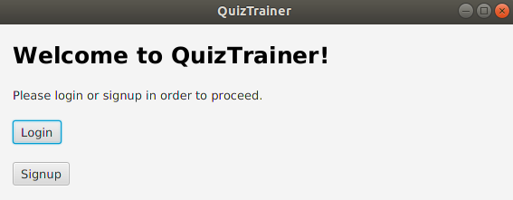
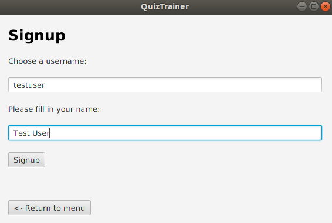
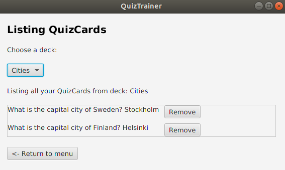
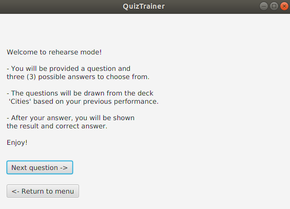

# User instructions

Download the latest jar file from [Releases](https://github.com/tommise/ot-harjoitustyo/releases/).

### Running the app
Run the app by writing following statement to the command line:
```
java -jar quiztrainer.jar
```

## Starting screen
Once the app has been launched, you will be forwarded to the starting screen. If you already have an account, you can move to login by pressing _Login_ button. Otherwise, consider signing up by pressing _Signup_ button.



### Signup
Creating a new account is straightforward, fill in your username and name on their corresponding fields and press _Signup_ button. If the username is valid, being it is not already taken or in invalid form you will be notified with a message that user has been created.



### Login
Now that you have an account, you can login by providing your username to the username field and pressing _Login_ button.


## Main screen

After login, you will be forwarded to the main scene. You have the following options:
- If you wish to create a new Deck, press _Add a new Deck_ button.
- If you wish to create a new QuizCard, press _Add a new QuizCard_ button.
- If you wish to list all your made QuizCards, press _My QuizCards_ button.
- If you wish to see statistics based on your performance, press _Statistics_ button.
- If you wish to rehearse made QuizCards, press _Rehearse_ button.
- If you wish to leave for now, press _Logout_ button.


### Creating a new Deck
When adding a new deck, you will be asked to type in the name of the deck. Choose a suitable name. It is recommended, that the decks act as a category for the QuizCards ie. Anatomy or Cities. Finally in order to add the deck, press _Add a deck_ button.


### Creating a new QuizCard
When adding a new card, you will be asked to type the question, right answer and three false but probable answers. Finally you will be asked to choose a appropriate Deck for the card. When you have filled the required forms, you can create the card by pressing _Add the created QuizCard_ button.


### My QuizCards
In my QuizCard you have the possibility to view your QuizCards in a specific Deck. Once the deck has been chosen from the Choose a deck drop menu and assuming there are cards in the deck, you will be provided all the QuizCards with question and right answer. All QuizCards will be accompanied with a _Remove_ button, where you have the possibility to remove added QuizCards.



### Statistics

Once you have rehearsed QuizCards you can start to view changes in statistics. If you are not rehearsed any cards, the stats will be zeros. You have the possibility to view the most rehearsed QuizCard and the QuizCards which you have answered most right and wrong.


### Rehearsing QuizCards

Once you have decided that it is time to practise made QuizCards and pressed the _Rehearse_ button in main screen, you will be forwarded to the choose a deck screen. Here you will choose the deck to be rehearsed from the _Select a deck_ dropdown menu. Once the chosen deck is selected press the _Rehearse mode ->_ button. Assuming that your deck is not empty, you will be forwarded to the instructions screen. Otherwise you will be given a notification that the deck is empty.


Now that the deck is chosen, you will be shown basic instructions based on the rehearsing. Once you are ready to start rehearsing, press _Next question ->_ button



Once started you will be provided a card based on your performance. The question will be situated at top and you have three possible answers to choose from, all in random order. One answer is right, two answer options are wrong.


After you have answered, you will be let known whether your answer was correct or wrong. The cards you have answered incorrectly, will be trained more frequently. You have the option to continue training as long as you want by pressing _Next question ->_ after you have answered a question. Finally when you are ready, you can return to menu with the _<- Return to menu_ button.


### Logout

When you have want to logout from your account, press the _Logout_ button. Once pressed you will be forwarded back to the starting screen.
